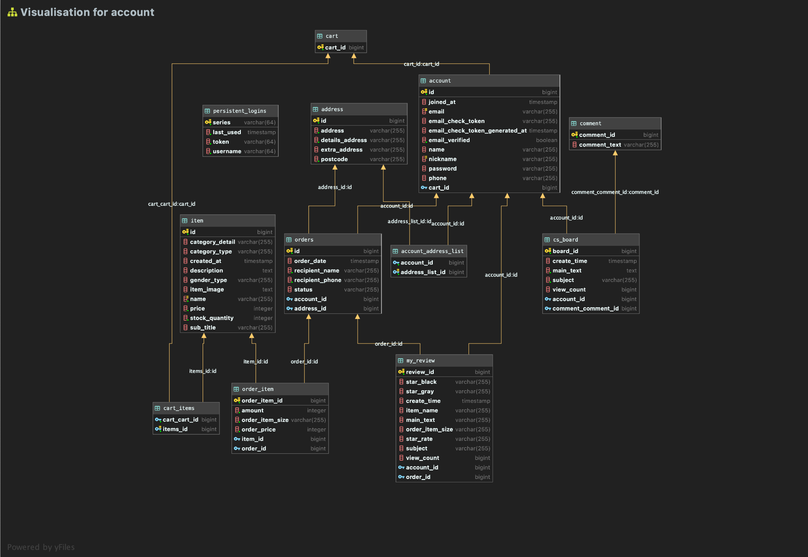
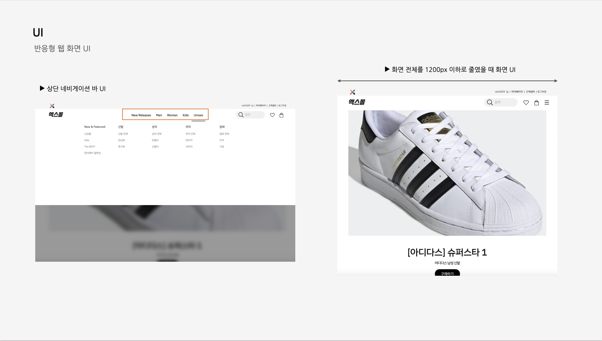
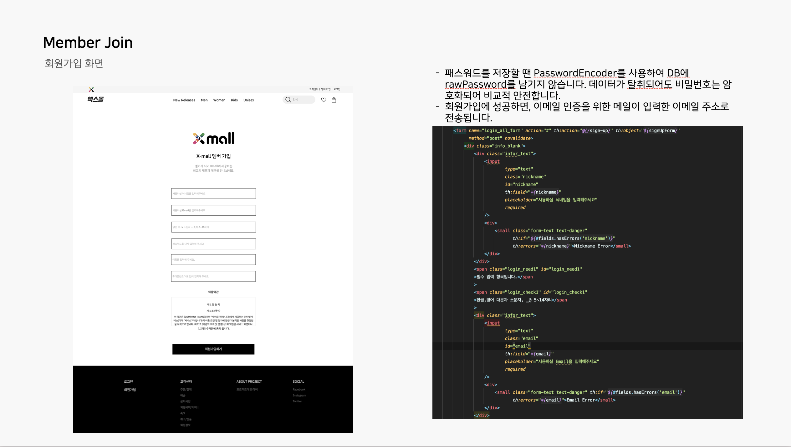
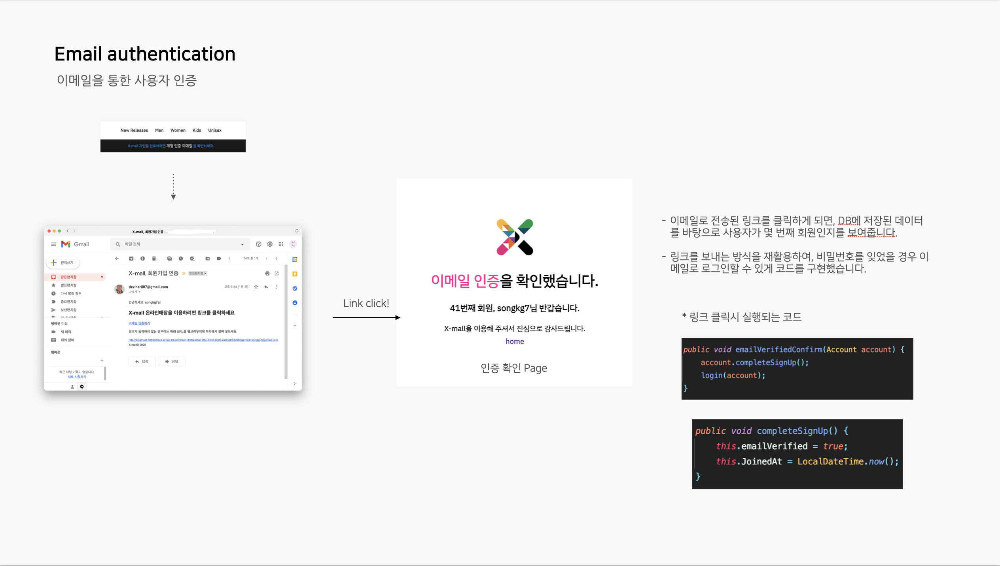
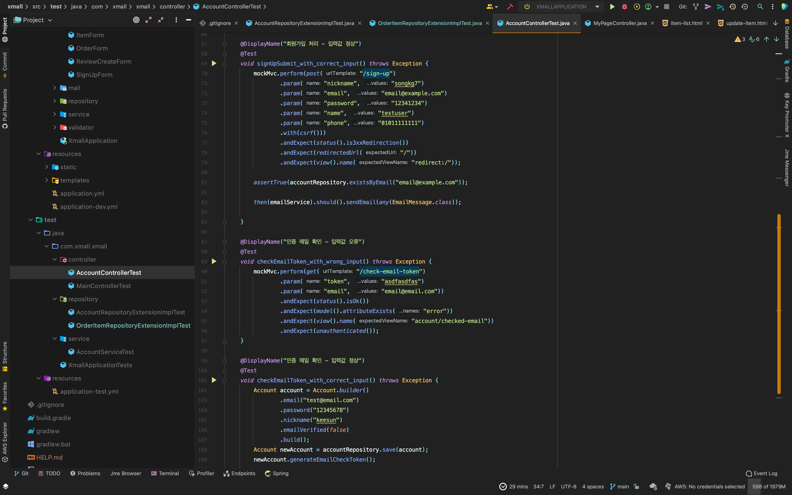

# Project. X-mall

## Info

쇼핑몰을 실제 운영할 수 있을 수준으로 구현해보는 프로젝트입니다.

## Project dependencies

- Java 11
- Springboot
- Spring Security
- Spring data JPA
- Gradle
- spring-boot-starter-mail
- Thymeleaf
- QueryDSL
- PostgreSQL
- H2
- NPM

## Preview

### Database Table Architecture

### Pages

### 다양한 테스트 코드 작성

- query를 비롯하여 여러 코드들이 정상작동하는지 확인하기 위해 TDD를 적용하였습니다.

## TODO & FIXME

1. 처음 계획과 달리 구현하지 못한 기능들이 있는데 다른 프로젝트를 통해 구현해볼 예정
2. 모든 기능에 테스트 코드를 작성해가면서 하고 싶었지만 아직 익숙하지 않은 방식이였고 시간에 쫓기느라 많은 부분은 테스트 코드를 작성하지 못했다 ㅠ
3. 몇몇 비효율적인 쿼리들의 성능을 개선하면 좋을 것 같다.
